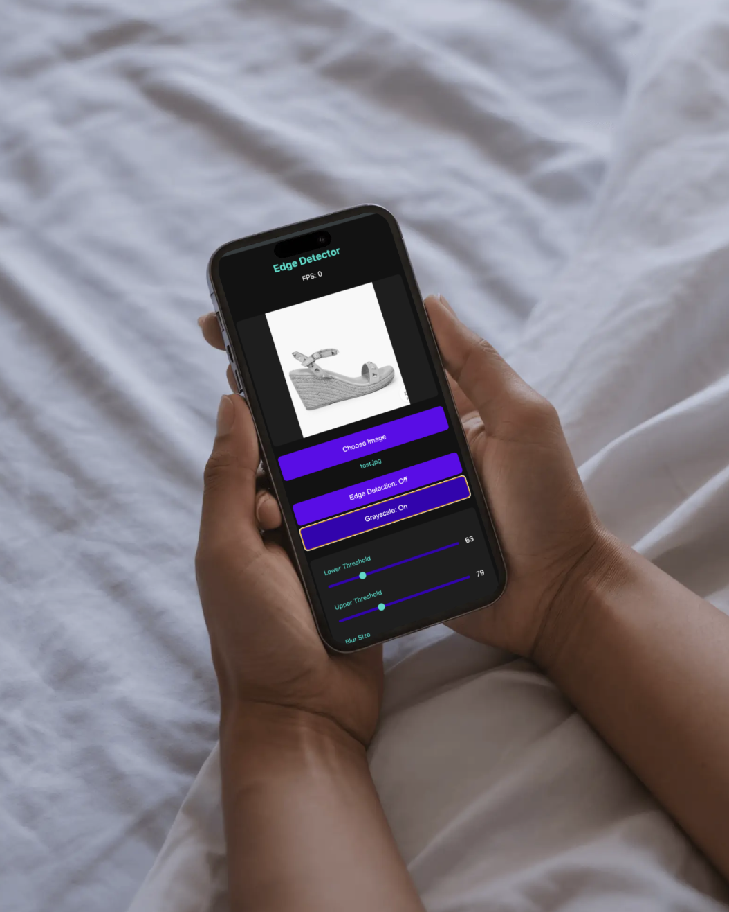

# Real-Time Edge Detection Android App

A real-time edge detection application that uses OpenCV for processing camera frames and displays them using OpenGL ES. The project includes both an Android app and a TypeScript-based web viewer.

## Features Implemented

### Android App
- ✅ Real-time camera frame capture using Camera2 API
- ✅ OpenCV-based edge detection processing in C++
- ✅ Hardware-accelerated rendering with OpenGL ES
- ✅ JNI bridge for native code integration
- ✅ Toggle between raw and processed views
- ✅ Real-time FPS counter and processing time display
- ✅ Grayscale shader effect

### Web Viewer
- ✅ TypeScript-based frame viewer
- ✅ Edge detection processing
- ✅ Frame statistics display (FPS, resolution)
- ✅ Adjustable processing parameters
- ✅ Loading states and progress indication
- ✅ Drag-and-drop image support

## Screenshots

### Web Viewer Screenshots

#### Normal View

*Initial state with uploaded image*

#### Grayscale View

*Image with grayscale filter applied*

#### Edge Detection View

*Image with edge detection processing*

### Android App Screenshots
*[Android app screenshots will be added once the app is deployed to physical device]*

## Architecture

### Frame Processing Pipeline
```
┌─────────────┐    ┌──────────┐    ┌─────────────┐    ┌──────────┐
│  Camera2    │ -> │   JNI    │ -> │  OpenCV C++ │ -> │  OpenGL  │
│   API       │    │  Bridge  │    │  Processing │    │   ES     │
└─────────────┘    └──────────┘    └─────────────┘    └──────────┘
```

### Components

1. **Camera Integration (Java/Kotlin)**
   - Uses Camera2 API for frame capture
   - YUV_420_888 to RGBA conversion
   - Frame rate management

2. **Native Processing (C++/JNI)**
   ```cpp
   // JNI Bridge
   extern "C" JNIEXPORT jint JNICALL
   Java_com_example_edgedetector_NativeBridge_processFrame(
       JNIEnv* env, jobject, jbyteArray input, jint width, 
       jint height, jbyteArray output)
   ```

3. **OpenGL Rendering**
   - Custom GLSL shaders for rendering
   - Texture streaming optimization
   - Hardware-accelerated display

4. **Web Viewer (TypeScript)**
   - Modular architecture with separate viewer and processing classes
   - Real-time parameter adjustment
   - Performance monitoring

## Setup Instructions

### Prerequisites
- Android Studio Arctic Fox or newer
- NDK 23.0.7599858 or newer
- OpenCV 4.x Android SDK
- Node.js 14+ and npm

### Android App Setup

1. Clone the repository:
   ```bash
   git clone <repository-url>
   cd edge-detector
   ```

2. Download OpenCV Android SDK:
   - Download from https://opencv.org/releases/
   - Extract to project root as 'opencv/'

3. Open in Android Studio:
   - Open project
   - Install NDK if prompted
   - Sync Gradle
   - Build project

4. Run on device:
   - Connect Android device (Android 7.0+)
   - Enable USB debugging
   - Run app

### Web Viewer Setup

1. Navigate to web directory:
   ```bash
   cd web
   ```

2. Install dependencies:
   ```bash
   npm install
   ```

3. Start development server:
   ```bash
   npm run dev
   ```

4. Open browser:
   - Navigate to http://localhost:5173
   - Upload sample processed image from Android app

## Performance

- Target FPS: 15-30 frames per second
- Processing time: ~50-100ms per frame
- Supported resolutions: 640x480, 1280x720
- Memory usage: ~100MB average

## Dependencies

All dependencies used are free and open-source:

- OpenCV 4.x (Apache License 2.0)
- Android SDK (Apache License 2.0)
- Android NDK (Apache License 2.0)
- TypeScript (Apache License 2.0)
- Vite (MIT License)

## Project Structure

```
project-root/
├── app/                          # Android application
│   ├── src/
│   │   ├── main/
│   │   │   ├── java/.../
│   │   │   │   ├── MainActivity.kt
│   │   │   │   ├── CameraManager.kt
│   │   │   │   └── NativeBridge.kt
│   │   │   ├── cpp/              
│   │   │   │   ├── native-lib.cpp
│   │   │   │   └── opencv_processor.cpp
│   │   │   └── gl/               
│   │   │       ├── GLRenderer.kt
│   │   │       └── TextureRenderer.kt
├── web/                          
│   ├── src/
│   │   ├── main.ts
│   │   ├── frameViewer.ts
│   │   └── types.ts
│   └── index.html
```

## Development Process

The project was developed in the following stages:

1. Initial Setup
   - Project structure creation
   - Dependency configuration
   - Git repository initialization

2. Android Development
   - Camera integration
   - Native code setup
   - OpenGL rendering pipeline

3. Web Viewer
   - TypeScript project setup
   - Frame viewer implementation
   - UI/UX development

4. Testing & Optimization
   - Performance testing
   - Memory optimization
   - UI refinement

## Contributing

1. Fork the repository
2. Create your feature branch
3. Commit your changes
4. Push to the branch
5. Create a Pull Request

## License

This project is licensed under the MIT License - see the LICENSE file for details.